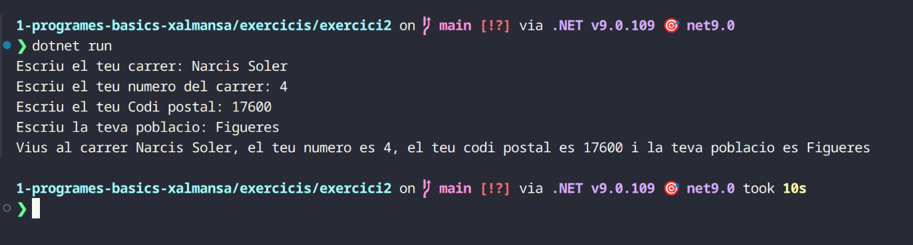
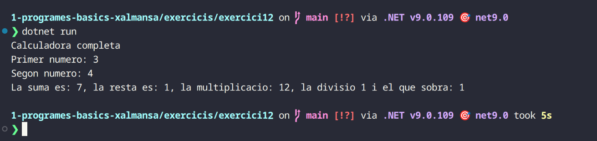

# Documentació:
## Exercici 1:
```csharp
class Program
{
    static void Main(string[] args)
    {
        Console.Write("Entra el nom: ");
        var nom = Console.ReadLine();
        Console.Write("Entra el cognom: ");
        var cognom = Console.ReadLine();

        Console.WriteLine($"Em dic {cognom}, {nom} {cognom}");
    }
}
```

Crearem una variable pel nom i pel cognom i quan fem el WriteLine el posarem dues vegades per poder fer el que demana l'enunciat.

## Exercici 2:
```csharp
class Program
{
    static void Main(string[] args)
    {
        Console.Write("Escriu el teu carrer: ");
        var carrer = Console.ReadLine();
        Console.Write("Escriu el teu numero del carrer: ");
        var numero = Console.ReadLine();
        int numerocarrer = Convert.ToInt16(numero);
        Console.Write("Escriu el teu Codi postal: ");
        var codi = Console.ReadLine();
        int codiposta = Convert.ToInt16(codi);
        Console.Write("Escriu la teva poblacio: ");
        var poblacio = Console.ReadLine();

        Console.WriteLine($"Vius al carrer {carrer}, el teu numero es {numero}, el teu codi postal es {codi} i la teva poblacio es {poblacio}");
    }
}
```

Crearem 4 variables per cada cosa que ens demana l'enunciat i a mes farem servir l'int per poder convertir el codi postal a un numero enter ja que de normal amb el Console.ReadLine quan escribim en la terminal es transforma directament a string.

## Exercici 3:
```csharp
class Program
{
    static void Main(string[] args)
    {
        Console.Write("Quin producte vols? ");
        var producte = Console.ReadLine();
        Console.Write("Quin preu te? ");
        var preu = Console.ReadLine();
        Console.Write("Té estoc? ");
        var estoc = Console.ReadLine();
        bool ok;

        if (estoc == "si")
        {
            ok = true;
        }
        else
        {
            ok = false;
        }
        if (ok == true)
        {
            Console.WriteLine($"El producte que has seleccionat es: {producte}, el seu preu es de: {preu} i si hi ha estoc");
        }
        else
        {
            Console.WriteLine($"El producte que has seleccionat es: {producte}, el seu preu es de: {preu} i no hi ha estoc");
        }
    }
}
```

Aqui l'he complicat una mica mes i he volgut fer un booleá i també dos if i else per la part del estoc aixi si la persona que escriu en la terminal diu que si doncs si hi haura estoc si posa qualsevol altre cosa ho marcara com a fals aixi que dira que no hi ha estoc.

## Exercici 4:
```csharp
class Program
{
    static void Main(string[] args)
    {
        Console.WriteLine("Calculadora de euros a pesetas ");
        var pesetas = 166.386;
        int pesetas1 = Convert.ToInt16(pesetas);

        Console.Write("Preu en euros? ");
        var euros = Console.ReadLine();
        double euros1 = Convert.ToDouble(euros);
        Console.WriteLine($"El preu en pesetas es de: {euros1 * pesetas1}");
    }
}
```

En aquest exercici he utilitzat el int perque el enunciat deia que no es fes amb decimals aixi que ho he fet amb aquest, he trobat que es podria fer amb la funcio de Math.Round() per aixi arrodonir i la conversió de pesetas a euros sigui mes certera ja que el int nomes el trunca no arrodoneix pero no m'he volgut avançar del tema i fer el que m'han explicat.

## Exercici 5:
```csharp
class Program
{
    static void Main(string[] args)
    {
        Console.Write("El teu nom? ");
        var nom = Console.ReadLine();
        Console.Write("Any naixement? ");
        var any = Console.ReadLine();
        int any_naixement = Convert.ToInt16(any);
        var any1 = 2025;
        int resultat = any1 - any_naixement;
        Console.WriteLine($"Hola {nom}! Ja tens {resultat}");
    }
}
```

En aquest exercici el que he fet ha sigut restar el any actual per l'any que escrigui quan la terminal li diu l'any de naixement i aixi ens dona l'edat de la persona.

## Exercici 6:
```csharp
class Program
{
    static void Main(string[] args)
    {
        Console.WriteLine("Calculadora del perimetre d'un quadrat");
        Console.Write("Longitud d'un costat del quadrat: ");
        var costat = Console.ReadLine();
        int costat1 = Convert.ToInt16(costat);
        int resultat = costat1 * 4;
        Console.WriteLine($"El perimetre del quadrat es de: {resultat}");
    }
}
```

Aqui el que he fet ha sigut senzill el que fa es tu poses la longitud d'un costat i el multiplica per 4.

## Exercici 7:
```csharp
class Program
{
    static void Main(string[] args)
    {
        Console.Write("Primera nota: ");
        var nota = Console.ReadLine();
        float nota_int = Convert.ToSingle(nota);
        Console.Write("Segona nota: ");
        var nota1 = Console.ReadLine();
        float nota_int1 = Convert.ToSingle(nota1);
        Console.Write("Tercera nota: ");
        var nota2 = Console.ReadLine();
        float nota_int2 = Convert.ToSingle(nota2);
        var resultat = (nota_int + nota_int1 + nota_int2) / 3;
        Console.WriteLine($"La mitjana es de: {resultat}");
    }
}
```

Aqui ens demanara que fem la mitjana de les 3 notes, he volgut posar el float per si el numero que introdueixi esta amb decimals, despres es divideix entre 3 i ja ens dona el resultat.

## Exercici 8:
```csharp
class Program
{
    static void Main(string[] args)
    {
        Console.Write("Quants minuts son: ");
        var minuts = Console.ReadLine();
        int minuts1 = Convert.ToInt16(minuts);

        int hores = minuts1 / 60;

        int total = minuts1 % 60;

        Console.WriteLine($"Son: {hores} hores i {total} minuts");
    }
}
```

Aqui el que farem será dividir els minuts que s'introudeixin per 60 minuts (ja que 60 minuts es 1 hora) també he fet el % 60 per si quedes el resiudo que m'ho digui en minuts (exemple: Si li dic 130 minuts hem retornará que son 2 hores i 10 minuts).

## Exercici 9:
```csharp
class Program
{
    static void Main(string[] args)
    {
        Console.Write("Calculadora de metros a peus ");
        var metros = Console.ReadLine();
        float metros1 = Convert.ToSingle(metros);

        var pies = (metros1 * 3.28084);
        Console.WriteLine($"El resultat es: {pies}");
    }
}
```

Com aqui no demana treure els decimals he utilitzat el float en comptes del int i el que fará será multiplicar els metres per 3.28084 (ja que 1 metre es 3.28084 peus).

## Exercici 10:
```csharp
class Program
{
    static void Main(string[] args)
    {
        Console.Write("El teu nom: ");
        var nom = Console.ReadLine();

        Console.Write("El teu any de naixement: ");
        var any = Console.ReadLine();
        int any1 = Convert.ToInt16(any);

        Console.WriteLine($"La teva contrasenya super segura es: {nom}{any1}");
    }
}
```

Aixo es bastant senzill en 2 variables agafa el nom i l'any de naixement i crea una contraseña quan l'adjuntem al WriteLine.

## Exercici 11:
```csharp
class Program
{
    static void Main(string[] args)
    {
        Console.WriteLine("La teva adreça de correu");
        Console.Write("Nom d'usuari: ");
        var nomusuari = Console.ReadLine();

        var domini = ("cendrassos.net");

        Console.WriteLine($"La teva adreça de correu es: {nomusuari}@{domini}");
    }
}
```

Aqui el que he fet ha sigut que la persona que executi el programa haura de escriure en la terminal el seu nom d'usuari i aixo ho recull una variable i en un altre variable tinc el domini despres en una WriteLine ho adjunto tot i poso tambe el @ i ja crea correus.

## Exercici 12:
```csharp
class Program
{
    static void Main(string[] args)
    {
        Console.WriteLine("Calculadora completa");
        Console.Write("Primer numero: ");
        var numero = Convert.ToInt16(Console.ReadLine());

        Console.Write("Segon numero: ");
        var numero2 = Convert.ToInt16(Console.ReadLine());

        var suma = numero + numero2;
        var resta = numero2 - numero;
        var multiplicació = numero * numero2;
        var divisio = numero2 / numero;

        var sobradivisio = divisio % numero;
        
        Console.WriteLine($"La suma es: {suma}, la resta es: {resta}, la multiplicacio: {multiplicació}, la divisio {divisio} i el que sobra: {sobradivisio}");
    }
}
```

Aquesta calculadora fa operacions senzillas com sumar, restar i multiplicar, també divideix i també té un modul com hem vist abans per si en la divisio sobra algo.

## Exercici 13:
```csharp
class Program
{
    static void Main(string[] args)
    {
        Console.WriteLine("Transformador de dates sense format");
        Console.Write("Introdueix data sense format: ");
        var data = Console.ReadLine();

        var dia = data.Substring(0,2);
        var mes = data.Substring(2,2);
        var any = data.Substring(4);

        Console.WriteLine($"{dia}/{mes}/{any}");
    }
}
```

Aqui es el mateix pero hi ha una nova funcio que es el data.Substring el que farem amb aixo será des de la posicio que li diguem que es quedi amb el numero de caracters que li especifiquem, basicament, si tenim el numero 15052006 i li diguem (0,2) el que agafará será el 15 ja que el 0 es el 1 i el 2 es perque agafi 2 caracters on aquest inclou el 0 i despres aixi amb el mes. Amb l'any posarem un 4 directament perque agafi des de la posicio 4 fins al final que hem escrit.

## Exercici 14:
```csharp
class Program
{
    static void Main(string[] args)
    {
        Console.Write("Escriue la paraula: ");
        var paraula = Console.ReadLine();
        var primera = paraula[0];
        var mitj = paraula[paraula.Length / 2];
        var ultima = paraula[paraula.Length - 1];

        Console.WriteLine($"La primer lletra es: {primera}, la lletra del mitj {mitj} i la ultima lletra es: {ultima}");
    }
}
```

En aquest exercici ens demana una paraula i ell el que fará será dirnos la primera lletra, la lletra del mitj i la ultima lletra, per poder fer aixo primer farem una variable, perque alla guardi el caracter que despres volem mostrar en el WriteLine, i farem paraula[0] perque aixi agafi la primera lletra de la part del ReadLine per fer la del mitj farem servir el paraula[paraula.Length / 2] (no será exacte si la paraula es imparell) el Length serveix per dirnos el numero de caracters que te una paraula o frase pero si ho dividim entre / 2 ens dira la paraula del mitj i despres per agafar el ultim caracter farem servir el Length un altre cop pero aquesta vegada amb el - 1.

## Exercici 15:
```csharp
class Program
{
    static void Main(string[] args)
    {
        Console.Write("Escriu el teu nom: ");
        var nom = Console.ReadLine();
        string primeraLetraMayuscula = Char.ToUpper(nom[0]).ToString();
        string laresta = nom.Substring(1).ToLower();
        Console.Write("Escriu el teu cognom ");
        var cognom = Console.ReadLine();
        string primeraLetraMayuscula2 = Char.ToUpper(cognom[0]).ToString();
        string laresta1 = cognom.Substring(1).ToLower();
        
        var resultat = primeraLetraMayuscula + laresta;
        var resultat1 = primeraLetraMayuscula2 + laresta1;
        
        Console.WriteLine($"El teu nom i congom es: {resultat} {resultat1}.");
    }
}
```

En aquest exercici farem servir el string per poder fer el nom i el cognom. Per poder fer que el primer caracter sigui majuscula farem servir el Char.ToUpper(nom[0]).ToString() amb aixo el que farem es seleccionar el caracter 0 i posarlo com a majuscula amb el ToUpper despres per afegir el que queda de text farem un alter string que en aquest guardara la resta del que hem escrit Que aixo ho fará el Substring[1] que seleccionará tot el que hi ha despres del caracter 0 fins al final i obligarem que aquest text sigui minuscula amb el ToLower. Farem el mateix amb el cognom i despres ho posarem en un WriteLine (es podria posar per separat quan fem el output pero jo he volgut fer una variable abans amb el string de la majuscula i la resta per aixi es vegi millor i sigui mes facil d'entendre).

## Exercici 16:
```csharp
class Program
{
    static void Main(string[] args)
    {
        Console.Write("Nota de pràctiques: ");
        var practiques = Console.ReadLine();
        float nota = Convert.ToSingle(practiques);
        Console.Write("Nota de l’examen: ");
        var examen = Console.ReadLine();
        float nota1 = Convert.ToSingle(examen);
        float resultat = (nota * 0.3f) + (nota1 * 0.7f);
        int resultat1 = (int)Math.Truncate(resultat);
        Console.WriteLine($"La nota final és {resultat} o sigui un {resultat1}");
    }
}
```

Aqui farem casi el mateix que amb el de les mitjanes, farem un float que alla guardará la nota que hem escrit i per l'output crearem un float pel resultat (vaig veure que la nota de practiques conta un valor i la d'examen un altre aixi que he multiplicat cadascun pel numero que li toca) i despres truncarem la nota amb el Math.Truncate perque ens dongui la nota com a numero enter.

## Exercici 17:
```csharp
class Program
{
    static void Main(string[] args)
    {
        Console.Write("Número lleig: ");
        var lleig = Console.ReadLine();
        float numero = Convert.ToSingle(lleig);
        float enter = (float)Math.Truncate(numero);
        float resultat = numero - enter;
        var resultat1 = Math.Round(resultat,2);
        Console.Write($"Nombre meravellós: {resultat1}");
    }
}
```

Aqui farem casi el mateix que abans li direm que ens dongui un numero lletj com ara 42,65 i en un float guardarem la resta entre el numero lleig i nomes el enter aixi nomes ens quedará els decimals i farem servir el Math.Round per arrodonir el resultat amb 2 decimals (ja que sino fem aixo no sortira molt precis).

## Exercici 18:
```csharp
class Program
{
    static void Main(string[] args)
    {
        Console.Write("Hora actual: ");
        int actual = Convert.ToInt16(Console.ReadLine());
        Console.Write("Hores a incrementar: ");
        int increment = Convert.ToInt16(Console.ReadLine());
        var resultat = actual + increment;

        if (resultat > 12)
        {
            var resultat1 = resultat - 12;
            Console.WriteLine($"D'aquí a {increment} hores seran les {resultat1}");
        }
        else
        {
            Console.WriteLine($"D'aquí a {increment} hores seran les {resultat}");
        }
    }
}
```

Aqui destacaré una cosa i es que vaig aprendre que si algu escriu en la terminal en comptes de que es guardi en format string es guardi directament com a int aixo ho farem amb la linia de "int actual = Convert.ToInt16(Console.ReadLine());", el que he volgut fer aqui es que es sumi la hora actual amb l'hora que es vol incrementar despres he creat un if/else per si es supera las 12 torni a començar amb l'1.

## Exercici 19:
```csharp
class Program
{
    static void Main(string[] args)
    {
        Console.Write("Digues una paraula: ");
        var paraula = Console.ReadLine();

        var longitud = paraula.Length;

        Console.WriteLine($"La paraula es: {paraula} i la seva longitud es: {longitud}");
    }
}
```

Aquest es molt senzill en una variable guardará la paraula que s'ha escrit en la terminal i en un altre variable i tindrem la allargada de la paraula que ho farem fent paraula.Length.

## Exercici 20:
```csharp
class Program
{
    static void Main(string[] args)
    {
        Console.Write("Entra el número a invertir: ");
        var numero = Console.ReadLine();
        char numero1 = numero[0];
        char numero2 = numero[1];
        char numero3 = numero[2];

        Console.WriteLine($"El número invertit és: {numero3}{numero2}{numero1}");
    }
}
```

Per poder fer aquest exercici hi ha dues formes i es amb dotzenas i centenes o aquesta, en la meva opinio aixi es mes facil i es veu millor, el que farem será amb el char agafar el primer numero que s'escriu i en el output el posarem l'ultim i farem el mateix pero a l'inversa amb l'ultim caracter (es pot veure que no he forçat a que la variable numero sigui un int pero es que si ho feia amb donava error i he vist que si ja posava el numero el programa ja sap que es un int perque nomes conté numeros enters).